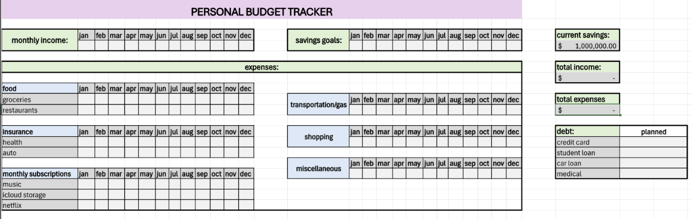
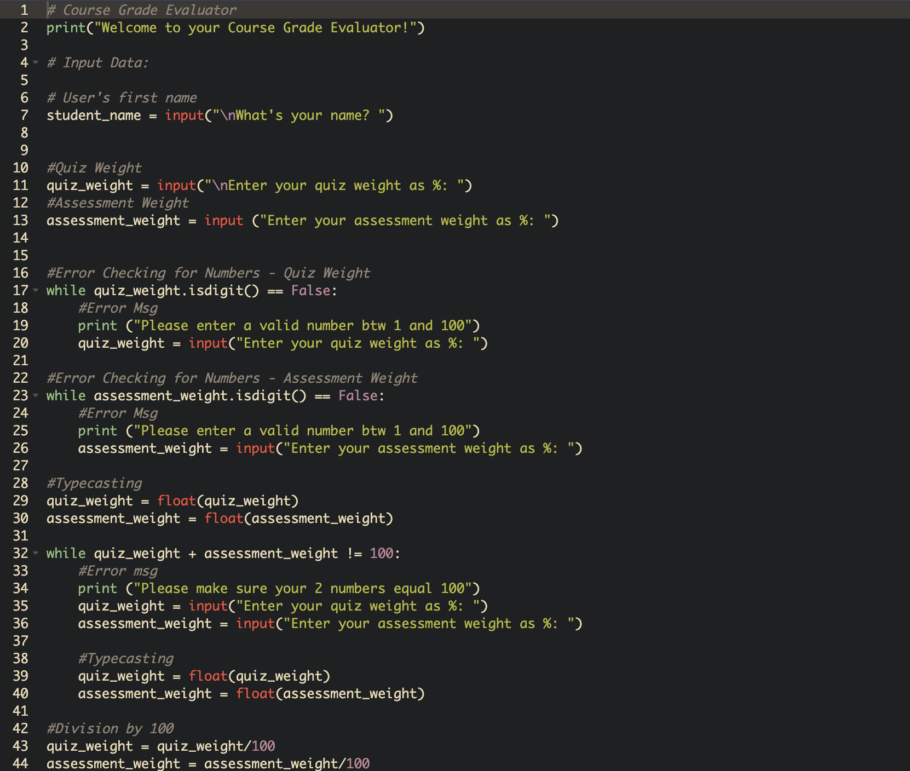
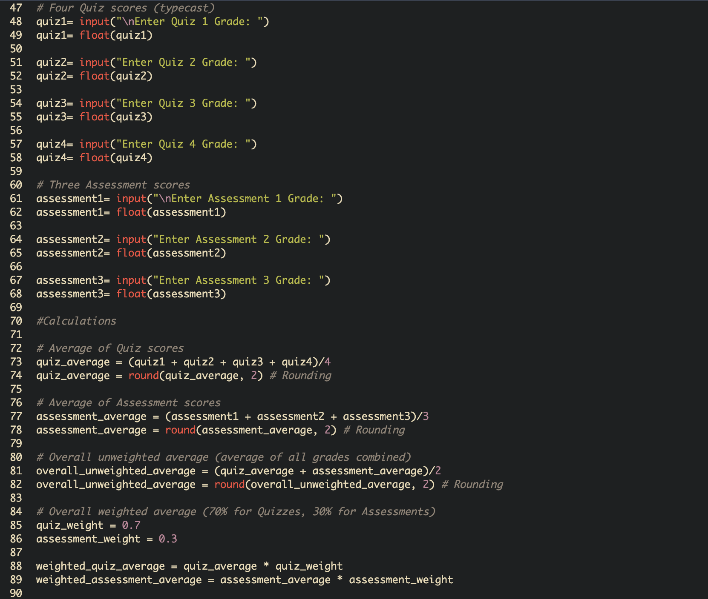
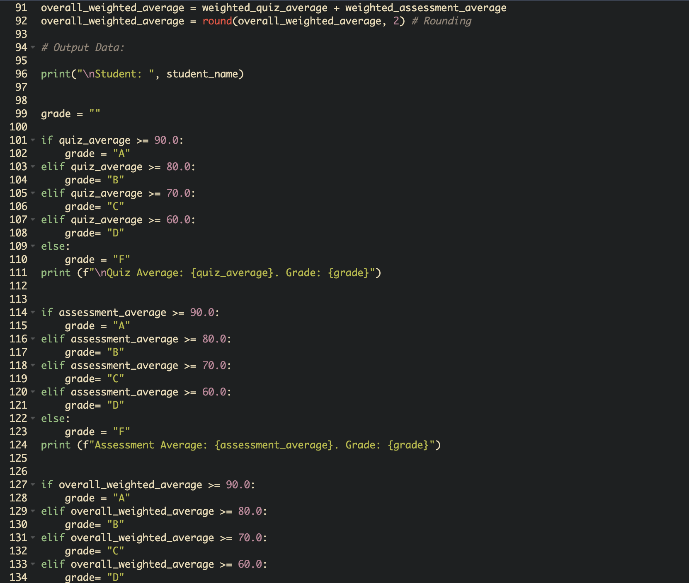
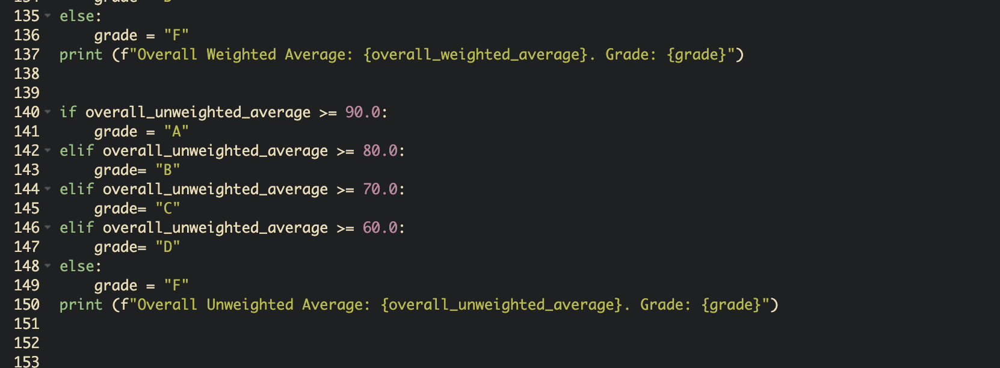
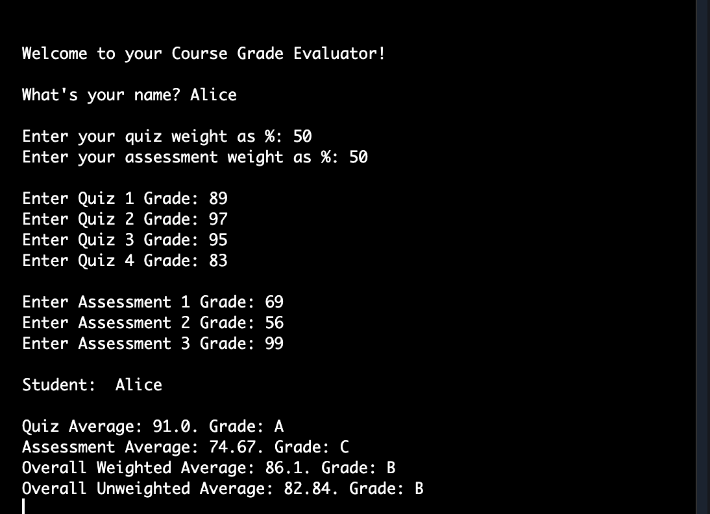
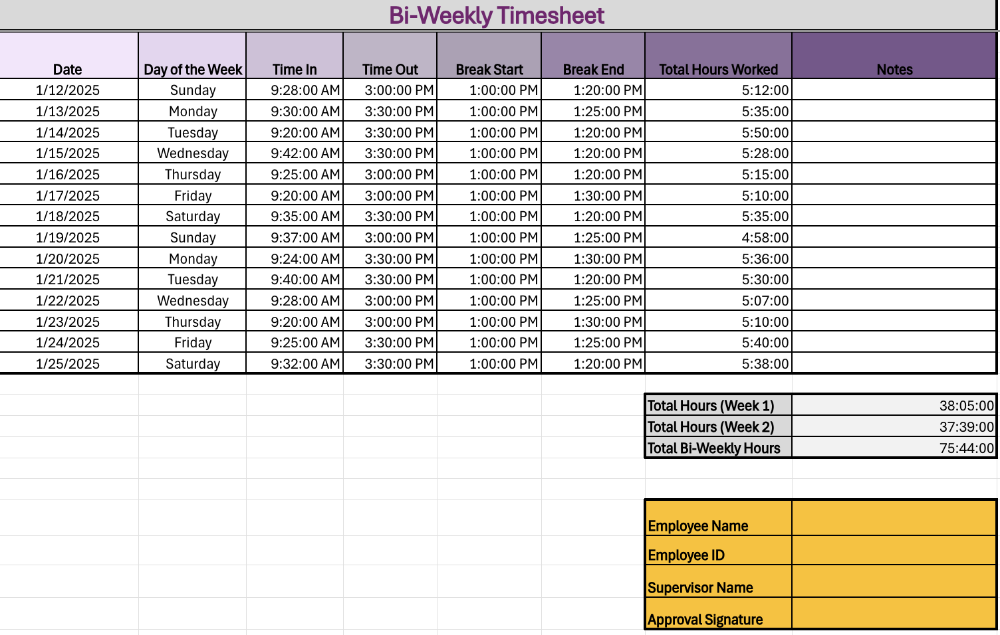

# Alice Lin

**Contact Info**: 302-290-2443 / alin2@loyola.edu

### About Me

Hello! I am a psychology student and an aspiring child counselor with a year of proven childcare and ESL Tutoring expertise.  

With skills in communication, teaching, and creative problem solving, I can work with children in various settings and help them achieve their academic goals. I am adept at using positive reinforcement, Total Physical Response (TPR), and Communicative Language Teaching (CLT). 

My specific skill set, commitment to child and family care, and passion for advocating for children’s mental health make me a valuable asset. I enjoy photography, cooking, and doing yoga in my free time.  
 
You can find me on [LinkedIn](www.linkedin.com/in/alice-lin-83325033a). 

### Education
**B.A. in Psychology**  
Loyola University Maryland

***
### Projects

#### Personal Budget Tracker
The personal budget tracker project serves to track all my finances, including current savings, monthly income, expenses, debts, and savings goals. 

My goal for this project was to compartmentalize my expenses into their own sections, so I can become more aware of what I'm spending money on. I learned to navigate Excel and use basic formulas, like ”=SUM”,  to calculate the total income and expenses. The main challenge with this project was figuring out the layout and how I should label things in a way that is clear and easy to follow. However, that challenge was easy to overcome once I put all the information down, and I played around with the borders and shading. Some resources that helped me with this project were the sample budget trackers. I used them as a guide for what information to include. I did achieve the objective of the project, which was to create a clean budget tracker that will help me easily trace my monthly expenses and set saving goals for myself. If I had the chance to take this project further, I would look into developing a long-term plan for repaying loans. For instance, I would include more information on how much is owed, the interest rates, and how long it would take to repay them. The project helped me think about my future when I become financially independent and must worry about more expenses like rent or mortgage payments, car insurance, family, and more. I should start budgeting and saving now so I can manage everything when the time comes.

***
#### Couse Grade Evaluation
The Course Grade Evaluation is a Python-based project, requiring us to build a program that prints out a student’s average quiz, assessment, and overall course grade. 

The code provides a more convenient way for users to calculate all the grades for the class, while also seeing the breakdown. I learned how to use JDoodle to calculate the average, error-check, type cast, and display a letter grade along with the group average. The project was a bit of a challenge, especially because I was still getting used to programming with Python. Error checking was the most challenging because I had just learned about it and was confused about how to write it on my own. I overcame this challenge by modeling off the example provided in class. The resource that helped me with this project was also revisiting the class recording to help me with the areas I struggled with. I ran the code multiple times with various inputs and everything worked perfectly. If I took the project further, I would include error checking in the inputs of the quiz and assessment to prevent any form of error. The project assessed a variety of skillsets that we learned during the unit on Python, making me more detail-oriented and considerate of all the possible ways errors can be prevented. 

***
#### Bi-Weekly Timesheet
This project is a bi-weekly Excel timesheet designed to track clock-in and clock-out time, break periods, and total hours worked, ensuring a precise record-keeping, and simplified work hour calculation for both employees and employers.

The goal of this project is to improve organization and time management in the workplace. The timesheet assists employees and employers with accurate hours and payment calculation. The project was created in Excel. I used various formulas to calculate total hours worked, excluding the break. I also learned about various formatting for the dates, days of the week, hours, and time. The only challenge in this project was making sure data was entered in the correct format, like the hh:mm AM/PM format. Once I entered all my test data and the formulas, I double-checked to see if everything was adding up correctly. The only resource I used was the sample timesheet that was provided as an example. The results turned out just as I wanted. Everything was also organized and easy to read. If I had the chance to take the project further, I would include the pay rate and calculate the amount to pay the employee based on their timesheet. 
